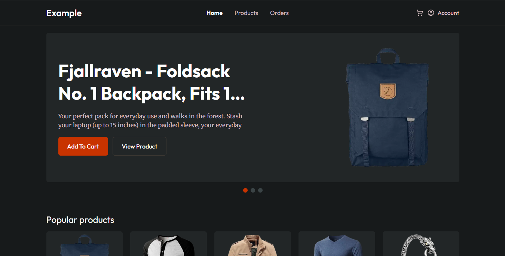

# 🛍️ Modern E-Commerce Frontend

A sleek and responsive **E-Commerce web application** built with modern frontend technologies.  
This project showcases product browsing, cart management, and order simulation — all powered by data from the [Fake Store API](https://fakestoreapi.com/).

---

## 🚀 Features

- 🧩 **Dynamic Product Listing** — fetches data from a real API.
- 🔍 **Product Detail Page** — displays detailed info for each product.
- 🛒 **Cart Functionality** — add, remove, and update product quantities.
- 📦 **Order Simulation** — allows users to "place orders" (frontend only).
- 📱 **Fully Responsive** — optimized for all screen sizes.
- ⚡ **Optimized Performance** — with lazy loading and efficient rendering.

---

## 🧠 Tech Stack

| Category             | Tools                                                              |
| -------------------- | ------------------------------------------------------------------ |
| **Framework**        | [Next.js 15](https://nextjs.org/) + [React 19](https://react.dev/) |
| **Styling**          | [Tailwind CSS 3](https://tailwindcss.com/)                         |
| **Icons**            | [Lucide React](https://lucide.dev/)                                |
| **State Management** | React Hooks / Context                                              |
| **API Source**       | [Fake Store API](https://fakestoreapi.com/)                        |
| **Deployment**       | [Vercel](https://vercel.com/)                                      |

---

## 🖼️ Preview



---

## 🏗️ Project Setup

```bash
# Clone this repository
git clone https://github.com/yourusername/ecommerce-frontend.git

# Navigate to the project folder
cd ecommerce-frontend

# Set base url project
set environment variables in .env file

# Install dependencies
npm install

# Run the development server
npm run dev
```
